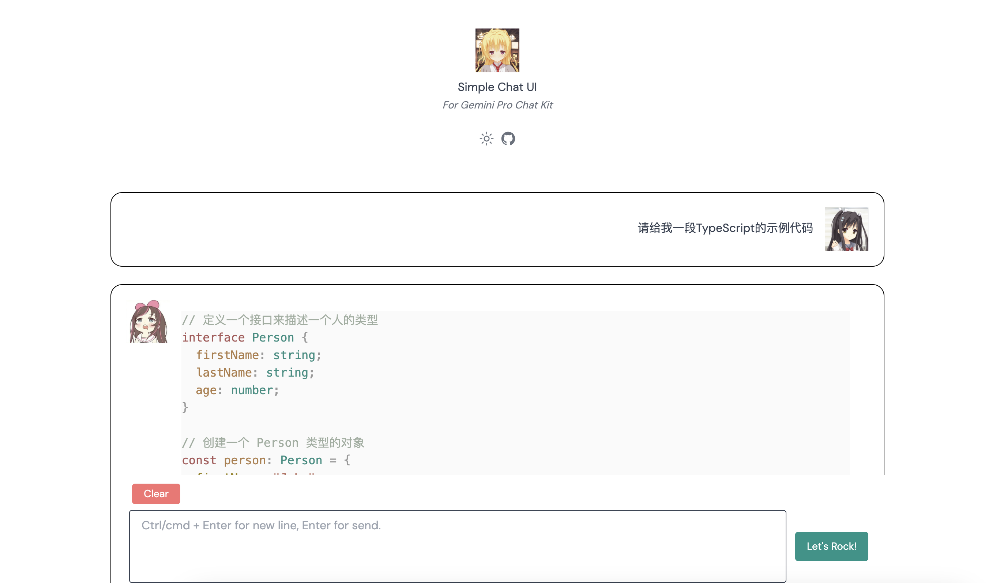
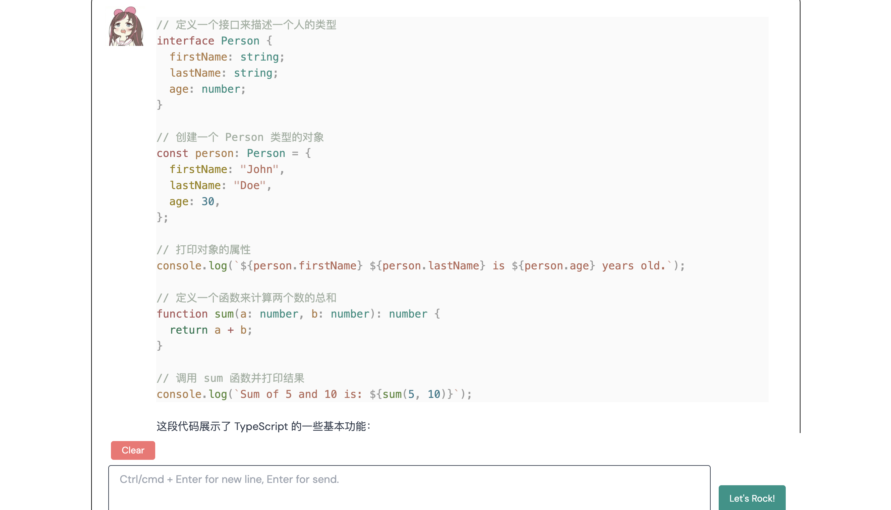

# Gemini Pro Chat Kit
一个解决了中国国内代理问题的Gemini Pro对话服务

## 问题在哪？
Gemini Pro官方提供的SDK在本地开启代理的状况下，仍然无法访问，因为模块中的fetch函数并未走代理，本Repo就是解决这个问题的。
目前通过使用undici做代理，现在可以随时更新SDK了。

## 如何设置代理？
修改根目录的`proxy.ts`
```shell
export const proxyHost = '127.0.0.1'
export const proxyPort = 7890
```

## 如何启动项目?
首先将项目根目录的`.env.example`文件重命名为：`.env`，然后编辑
```
# your_key改为您的api key
API_KEY = your_key
```

### 申请API Key
申请Gemini Pro API Key: [https://makersuite.google.com/app/apikey](https://makersuite.google.com/app/apikey)

具体过程可以参考我的博客的其中一部分：[https://blog.vince-g.xyz/#/posts/deploy-gemini-pro](https://blog.vince-g.xyz/#/posts/deploy-gemini-pro)

然后

```shell
# 安装依赖
pnpm i 

# 构建源码
pnpm run build

# 以守护进程启动(崩溃会自动重启)
pnpm run start

# 停止守护进程
pnpm run stop
```

## 使用方法
目前，拢共就俩API

| API | 说明 | Method | 参数 | 返回值|
| - | - | - | - | - |
| /chat | 纯文本对话| POST | `{"message": "Feint是谁"}` | `{ "result": "Feint 是一名荷兰电子音乐制作人和 DJ。}` |
| /clear | 清空上下文 | GET | 无  | `{ msg: "成功清除上下文！" }` |


## 前端页面(WebUI)
开发中，已实现流式传输。默认调用流式接口，现已基本可用。

> [!NOTE]
> 前端页面还不完善，但是可以用





## 部署整个项目
在`packages/webui/.env.prod`中配置你的后端接口base url:

> [!NOTE]
> 请注意，一定要保证后端的端口配置与你前端.env.prod的端口配置相同

假设你的后端部署在`http://ciallo.yuzu:2333`

```toml
# .env.prod
# 不要包含末尾的斜杠 '/'
VITE_SERVER_BASE=http://ciallo.yuzu:2333
```

然后构建前后端即可:
```shell
# 构建前端
pnpm run webui:build

# 构建后端
pnpm run build
```